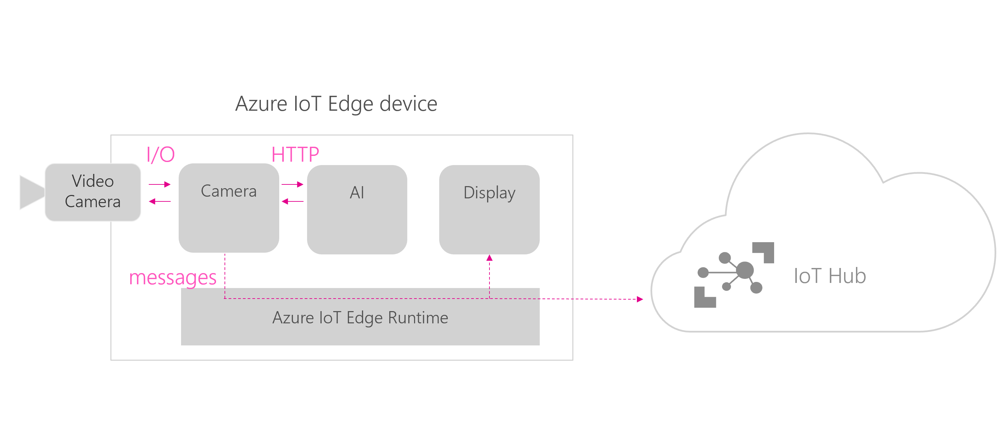

# IoT Solution for Customer Metrics

This is a project to deploy an AI model to a Raspberry Pi device running Azure IoT Edge. 
It will use an image classifier to detect the gender of visitors to a business location. 
 

## Prerequisites

### Hardware
This solution uses the following hardware:

- **Raspberry Pi Zero**
- **Raspberry Pi Camera**

 
### Services

- **Azure IoT Hub**
- **Azure Container Registry** 
- **Docker**
- **Custom Vision**

### Tooling

- **Visual Studio Code**
- **Visual Studio Code: Azure IoT Edge Extension**

## Description of the architecture
### Modules

- **Camera capture** - this module captures the video stream from a USB camera, sends the frames for analysis to the custom vision module and shares the output of this analysis to the edgeHub. This module is written in python and uses [OpenCV](https://opencv.org/) to read the video feed.
- **Custom vision** - it is a web service over HTTP running locally that takes in images and classifies them based on a custom model built via the [Custom Vision website](https://azure.microsoft.com/en-us/services/cognitive-services/custom-vision-service/). This module has been exported from the Custom Vision website and slightly modified to run on a ARM architecture. You can modify it by updating the model.pb and label.txt files to update the model.

### Communication between modules
This is how the above three modules communicate between themselves and with the cloud:

Reference: 
Microsoft IoT Custom Vison AI on Azure IoT Edge https://youtu.be/_K5fqGLO8us

