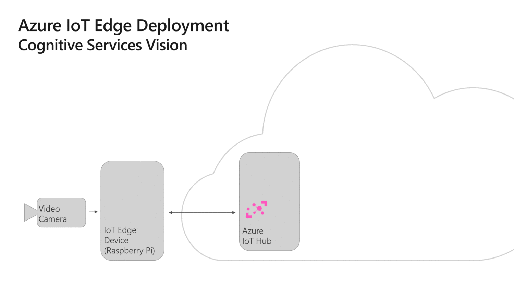

# Custom Vision + Azure IoT Edge on a Raspberry Pi

This is a project to deploy a Custom Vision model to a Raspberry Pi device running Azure IoT Edge. 
It will use Custom Vision as an image classifier to detect the gender of visitors to a business location. 
 

## Prerequisites

### Hardware
This solution uses the following hardware:

- **Raspberry Pi 3**: Set up Azure IoT Edge on a Raspberry Pi 3 ([instructions to set up the hardware - use raspbian 9 (stretch) or above)](https://blog.jongallant.com/2017/11/raspberrypi-setup/) + [instructions to install Azure IoT Edge](https://docs.microsoft.com/en-us/azure/iot-edge/how-to-install-iot-edge-linux-arm)) with a [SenseHat](https://www.raspberrypi.org/products/sense-hat/) and use the arm32v7 tags.

 
### Services

- **Azure IoT Hub**: 
- **Azure Container Registry**: 

### Tooling
You need the following dev tools to do IoT Edge development in general, to make this sample run and edit it:
- **Visual Studio Code**:
- **Visual Studio Code: Azure IoT Edge Extension**

## Description of the solution
### Modules
This solution is made of 3 modules:

- **Camera capture** - this module captures the video stream from a USB camera, sends the frames for analysis to the custom vision module and shares the output of this analysis to the edgeHub. This module is written in python and uses [OpenCV](https://opencv.org/) to read the video feed.
- **Custom vision** - it is a web service over HTTP running locally that takes in images and classifies them based on a custom model built via the [Custom Vision website](https://azure.microsoft.com/en-us/services/cognitive-services/custom-vision-service/). This module has been exported from the Custom Vision website and slightly modified to run on a ARM architecture. You can modify it by updating the model.pb and label.txt files to update the model.
- **SenseHat display** - this module gets messages from the edgeHub and blinks the raspberry Pi's senseHat according to the tags specified in the inputs messages. This module is written in python and requires a [SenseHat](https://www.raspberrypi.org/products/sense-hat/) to work. The amd64 template does not include this module since it is a raspberry pi only device.

### Communication between modules
This is how the above three modules communicate between themselves and with the cloud:

References used from Microsoft IoT YOUTUBE channel. 

### Update the configuration of the camera capture module
Explore the various [configuration options of the camera module](https://github.com/Azure-Samples/Custom-vision-service-iot-edge-raspberry-pi/tree/master/modules/CameraCapture), to score your ai model against a camera feed vs a video clip, to resize your images, to see logs, etc.
